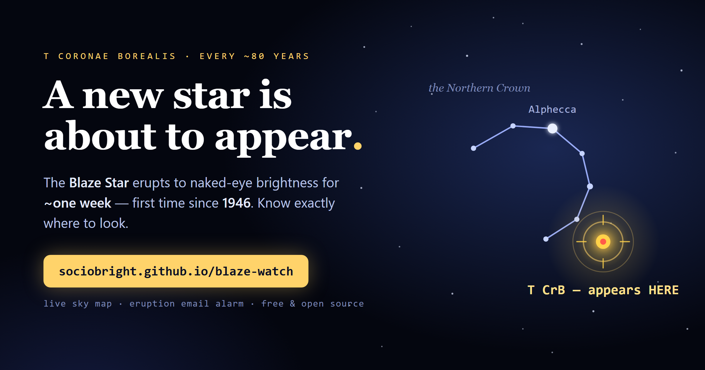

# 🌟 Blaze Watch

**Catch the Blaze Star the moment it erupts** — a live, interactive sky map *and* an eruption alarm for **T Coronae Borealis**, the recurrent nova that's about to become a naked-eye "new star" for the first time since 1946.

[](https://sociobright.github.io/blaze-watch/)
[](LICENSE)
-brightgreen)

> **▶ Try it now: https://sociobright.github.io/blaze-watch/**

<!-- TODO: drop a screenshot at docs/preview.png for the badge image and social cards -->



---

## The story

Somewhere in the constellation Corona Borealis, a white dwarf and a red giant orbit each other about 3,000 light-years away. Every ~80 years the white dwarf gathers enough hydrogen to detonate, and for a few nights a "new" star — magnitude ~2, as bright as Polaris — appears in the Northern Crown. It last happened in **1946**. Astronomers expect the next eruption **soon**.

The catch: the rise is measured in *hours* and the naked-eye window is only about *a week*. If you're not ready, you miss it. **Blaze Watch** makes you ready.

## What's inside

**1. The Finder** (`index.html`) — a single, self-contained web page:
- Live sky map that **rotates to any date and time** you set, so it's accurate whenever you're actually outside (not just one fixed hour).
- A plain-language readout: where the Crown is right now, how high, which way to face — and if it's below the horizon, when it's highest instead.
- **Tap any star** to identify it. A pulsing marker shows the exact spot the new star will appear.
- **Zoom toggle** — flip between the whole sky and a live close-up of the Crown, computed for your time and place (same orientation as the sky view, with direction arrows to Arcturus and Vega and a 5° scale bar).
- **Moon indicator** — phase, illumination, and an honest skyglow advisory (computed dependency-free from a truncated Meeus series); the moon is drawn on the sky map when it's up.
- **Share button** — copies a link with your location, date, and time, so the person you send it to sees *your* sky, not the default.
- No dependencies, no build, works offline. Just open it.

**2. The Alarm** (`monitor/`) — polls the AAVSO database and emails you the instant it brightens:
- **Apps Script version** — zero infrastructure, runs on Google's servers on a timer. Recommended.
- **Python version** — for a cron job on your own box.
- Two-tier: an early "heads-up" as it rises, and the full "it's erupting" alert. Sends each once.

## Quick start

**Just want to use it?** Open the [live demo](https://sociobright.github.io/blaze-watch/) — that's the whole finder.

**Run it locally:**
```bash
git clone https://github.com/sociobright/blaze-watch.git
cd blaze-watch
open index.html          # or just double-click it
```

**Set up the eruption alarm:** see [`monitor/README.md`](monitor/README.md). The Apps Script route takes about five minutes and needs no server.

## How it works

The finder computes each star's **altitude and azimuth** from its right ascension/declination using local **sidereal time** for the observer's location, then projects the sky onto a zenith-centered disc (centre = straight up, edge = horizon). It plots the bright guide stars, the Crown, and T CrB, and redraws on every date/time change.

The alarm queries the AAVSO VSX delimited API for recent observations, filters to naked-eye bands (V / Vis. / CV), ignores "fainter-than" upper limits, and fires when the brightest recent reading crosses a threshold (default mag 6 — quiescent flicker tops out around mag 9, so the margin is large).

## Accuracy & limitations

- Positions are **naked-eye approximate** — plenty to find the spot by eye, not for telescope pointing.
- The finder works for **any location on Earth** (geolocation, manual Lat/Lon, or `?lat=&lon=` URL params) and defaults to Cyprus (~35°N, 33°E) when none is given.
- Light-curve timings are the *expectation* from the 1866 and 1946 eruptions; the real event may differ.

## Roadmap

- [x] **Configurable location** — browser geolocation, `Lat`/`Lon` inputs, and `?lat=&lon=` URL params. Times are interpreted in the observer's own timezone.
- [x] **Reverse-geocode the coordinates to show a place name** — optional lookup via BigDataCloud's free, no-key client endpoint; degrades silently to raw lat/lon when offline or blocked.
- [ ] Greek / multi-language toggle.
- [ ] Push / Telegram alerts in addition to email.
- [ ] A fuller star catalogue and more constellation lines.

Contributions welcome — these are good first issues.

## Data & credits

This project uses variable-star observations from the **AAVSO International Database**, contributed by observers worldwide. We acknowledge them with thanks. Please see the [AAVSO](https://www.aavso.org) site for their data-usage guidance.

## Contributing

Issues and PRs are welcome. Keep the finder dependency-free and self-contained (it's a single HTML file on purpose). Astronomy corrections especially appreciated.

## License

[MIT](LICENSE) © 2026 George Chrysochou
